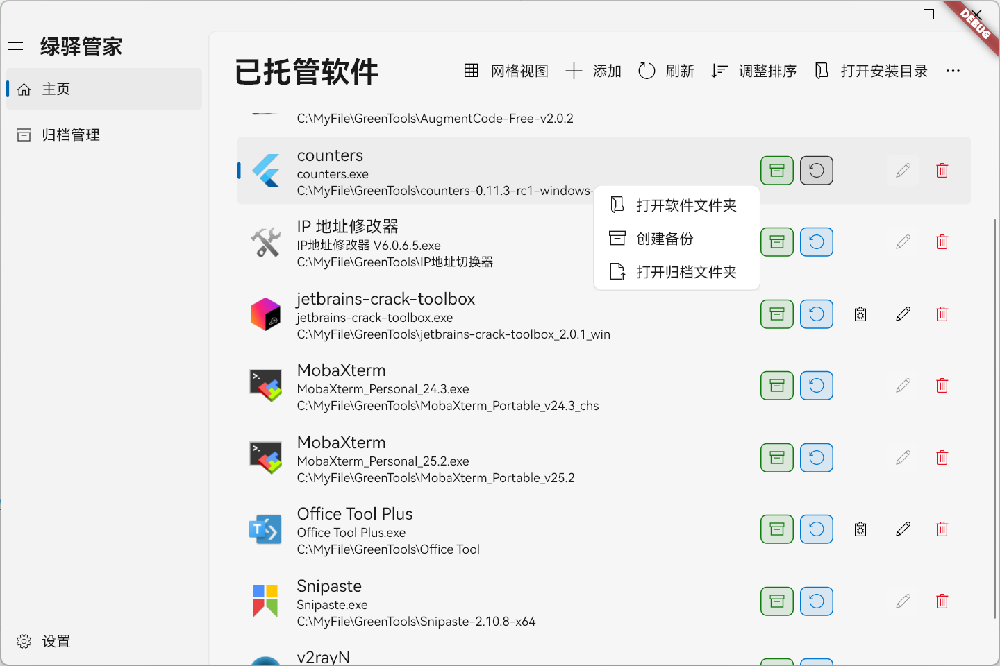
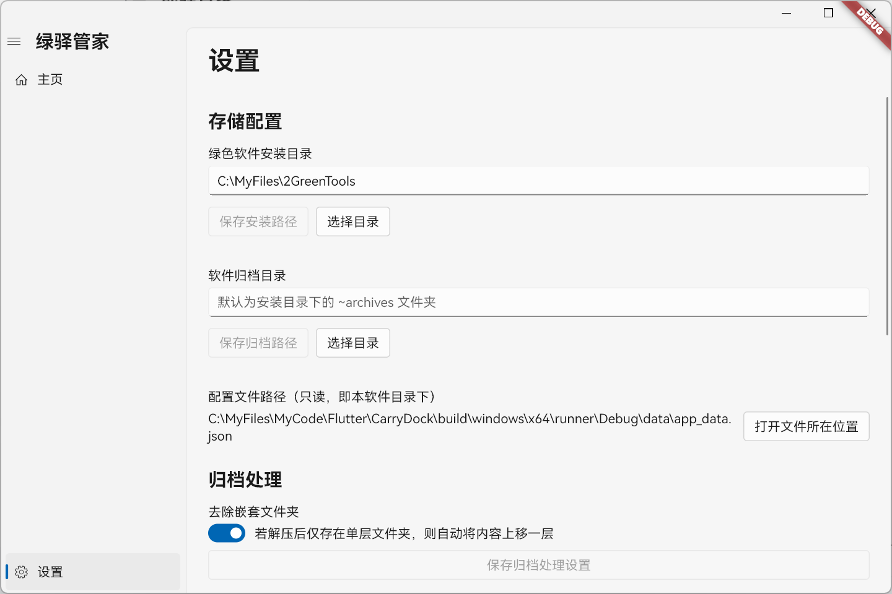
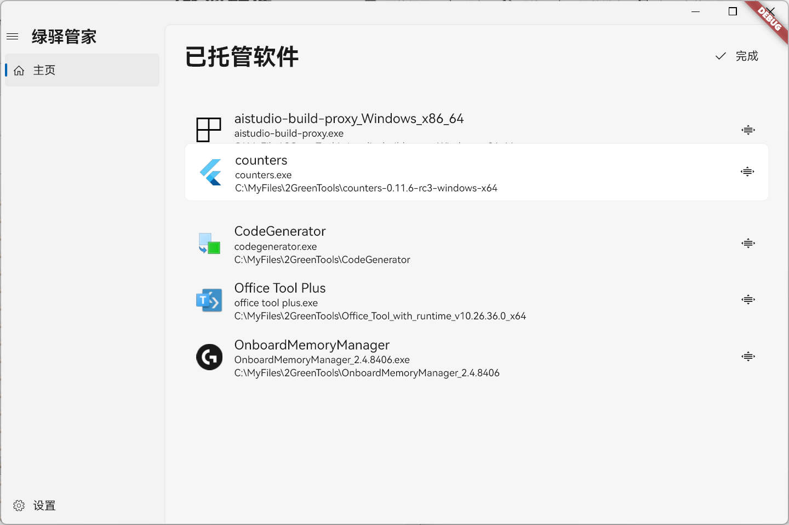

# CarryDock (绿驿管家)

CarryDock (
绿驿管家) 是一款专为 Windows 平台设计的绿色软件（便携软件）管理器。它旨在提供一个简洁、高效的方式来管理您的便携应用，无需安装，即刻使用。

## 核心功能

- **软件集中管理**: 自动扫描并展示指定目录下的所有绿色软件。
- **拖拽添加**: 支持通过拖拽压缩包 (如 `.zip`, `.tar.gz`) 或可执行文件 (`.exe`) 快速添加新软件。
- **自动解压与归档**: 添加软件时，能自动解压压缩包到软件库，并对原始压缩包进行归档管理。
- **主程序智能识别**:
    - 如果软件目录中只有一个可执行文件，则自动将其设为主程序。
    - 如果有多个，则会弹出对话框让用户选择。
- **自定义启动**: 支持启动备选可执行文件。
- **灵活的视图模式**: 提供列表和网格两种视图来展示您的软件。
- **自定义排序**: 在列表视图下，您可以通过拖拽来调整软件的显示顺序。
- **未知文件扫描**: 能够识别软件库中未被管理的文件夹和归档，方便用户进行清理或导入。
- **高度可配置**:
    - 用户可以自定义软件的安装目录和归档目录。
    - 支持配置识别哪些文件扩展名为可执行文件。
    - 可调整解压后是否移除多余的嵌套文件夹。
- **开发者模式**: 包含一些为开发者准备的测试功能，例如图标提取测试。

## 技术栈

- **框架**: [Flutter](https://flutter.dev/)
- **UI 库**: [fluent_ui](https://pub.dev/packages/fluent_ui) - 实现了 Windows 11 设计风格的组件库。
- **窗口管理**: [bitsdojo_window](https://pub.dev/packages/bitsdojo_window) - 用于自定义窗口样式（标题栏、按钮等）。
- **状态管理**: [Provider](https://pub.dev/packages/provider) - 轻量级的状态管理方案。
- **文件处理**:
    - [archive](https://pub.dev/packages/archive) - 用于处理 `.zip` 和 `.tar` 等格式的压缩包。
    - [file_picker](https://pub.dev/packages/file_picker) - 用于打开系统文件选择器。
    - [desktop_drop](https://pub.dev/packages/desktop_drop) - 实现文件拖拽功能。
- **Windows API 交互**: [win32](https://pub.dev/packages/win32) - 直接调用 Windows 系统 API，用于提取
  `.exe` 图标和文件信息。

## 项目结构

项目遵循标准的 Flutter 项目结构，核心业务逻辑位于 `lib` 目录下：

- `main.dart`: 应用入口，负责初始化、路由和窗口设置。
- **`models/`**: 存放数据模型，如 `software.dart` 定义了软件对象的结构。
- **`providers/`**: 存放使用 Provider 进行状态管理的类，例如 `ThemeProvider` 用于主题切换。
- **`screens/`**: 包含应用的主要页面，如主页 (`home_screen.dart`) 和设置页 (`settings_screen.dart`)。
- **`services/`**: 封装了应用的各项核心服务：
    - `software_service.dart`: 管理软件的添加、删除、加载等核心逻辑。
    - `settings_service.dart`: 负责应用设置的读取和存储。
    - `json_storage_service.dart`: 提供基于 JSON 文件的本地数据持久化。
    - `archive_extractor.dart`: 封装了各类压缩包的解压逻辑。
    - `executable_info_service.dart`: 调用 Windows API 来获取可执行文件的图标和描述信息。
- **`utils/`**: 存放通用工具类，如日志 (`logger.dart`)、全局错误处理 (`error_handler.dart`) 等。
- **`widgets/`**: 存放自定义的、可在多个页面复用的 UI 组件，例如软件列表项 (
  `software_list_tile.dart`)。

## 如何使用

1. **配置**: 首次启动应用后，请前往“设置”页面。
    - **必须**: 设置“绿色软件安装目录”，这是存放所有软件解压后文件的根目录。
    - **可选**: 设置“软件归档目录”，用于存放添加软件时上传的原始压缩包。若不设置，则默认为安装目录下的
      `~archives` 文件夹。
2. **添加软件**:
    - 点击主页的“添加”按钮，选择一个压缩包或可执行文件。
    - 或者，直接将文件拖拽到主窗口中。
3. **管理与启动**:
    - 在主页点击软件即可启动。
    - 右键点击软件条目可以打开其安装目录或归档目录。
    - 如果一个软件有多个可执行文件，可以通过列表项中的按钮来启动其他程序。