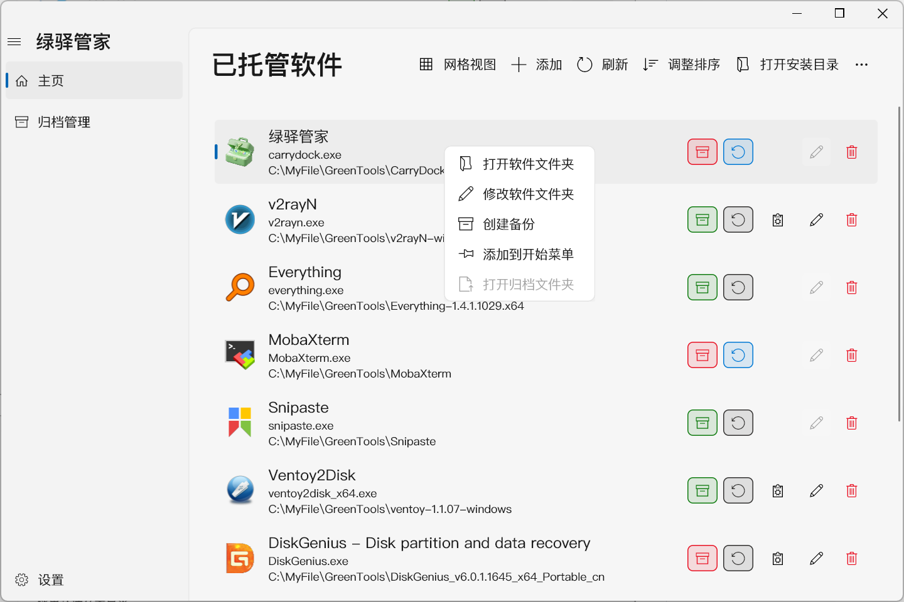
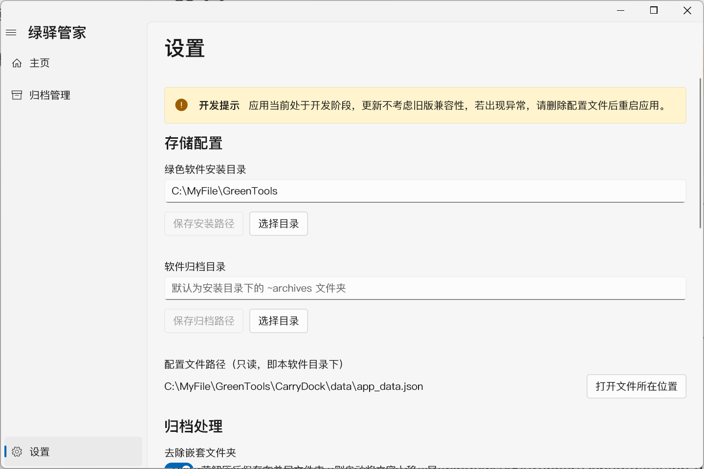

[**简体中文**](README_zh_CN.md)

# CarryDock

CarryDock is a portable software manager designed specifically for the Windows platform. It provides a clean and efficient way to manage your portable applications without requiring installation.

  

  

## Key Features

- **Centralized Software Management**: Automatically scan and display portable software in your installation directory
- **Drag & Drop Adding**: Drag and drop compressed files (ZIP/TAR/RAR/7Z, etc.) or executables to add software
- **Auto-Extraction & Archiving**: Automatically extracts compressed files to the installation directory and archives the source package
- **Smart Main Program Recognition**:
  - Automatically sets the main program when only one executable is found
  - Prompts user to select when multiple executables are detected
- **Alternative Launch**: Automatically scans for executables in installed directories with support for selecting alternative programs to launch
- **View Modes**: Toggle between list and grid display modes
- **Sorting Control**:
  - Drag-and-drop sorting in list view
  - Batch adjust and save order via the "Adjust Software Order" dialog
- **Unmanaged Item Detection**: Identify unmanaged folders in installation directory and unassociated archive files for cleanup or adoption
- **Archive Management (New Page)**: Centralized view/management of archives and backups with manual association, restore, and deletion support
- **Backup & Restore**:
  - Create timestamped backup ZIP files for any managed software
  - Restore from archives or backups (re-hosting)
- **Batch Scanning & Unified Association**: Batch scan subdirectories in installation directory, auto-create backups or associate with existing archives
- **Highly Configurable**:
  - Customize "Installation Directory" and "Archive Directory"
  - Configure "Executable File Extensions" and "Search Depth"
  - Toggle "Remove Redundant Nested Directories After Extraction"
- **Developer Options**: Hidden entry (click "Version" 5 times in Settings) enables icon extraction and other test features

## Tech Stack

- **Framework**: [Flutter](https://flutter.dev/)
- **UI Library**: [fluent_ui](https://pub.dev/packages/fluent_ui) - Windows 11 design style component library
- **Window Management**: [bitsdojo_window](https://pub.dev/packages/bitsdojo_window) - Custom window styling (title bar, buttons, etc.)
- **State Management**: [Provider](https://pub.dev/packages/provider) - Lightweight state management solution
- **File Processing**:
  - [archive](https://pub.dev/packages/archive) - Handle `.zip`, `.tar`, `.7z`, `.rar` and other compressed formats
  - [file_picker](https://pub.dev/packages/file_picker) - System file picker
  - [desktop_drop](https://pub.dev/packages/desktop_drop) - File drag-and-drop functionality
- **Windows API Integration**: [win32](https://pub.dev/packages/win32) - Direct Windows system API calls for extracting `.exe` icons and file information

## Project Structure

The project follows standard Flutter project structure with core business logic in the `lib` directory:

- `main.dart`: Application entry point, handles initialization, routing, and window setup
- **`models/`**: Data models, e.g., `software.dart` defines the software object structure
- **`providers/`**: Provider-based state management classes, e.g., `ThemeProvider` for theme switching
- **`screens/`**: Main application pages:
  - `home_screen.dart`: Main page (software management)
  - `settings_screen.dart`: Settings page
  - `archive_manager_screen.dart`: Archive management page for centralized view/manual association/deletion of archives and backups, restore from archives, create backups
- **`services/`**: Core service encapsulation:
  - `software_service.dart`: Core logic for software addition, deletion, and loading (74KB, largest file)
  - `settings_service.dart`: Application settings read/write
  - `json_storage_service.dart`: JSON-based local data persistence
  - `archive_extractor.dart`: Archive extraction logic for various compressed formats
  - `executable_info_service.dart`: Windows API calls to get executable icons and description
  - `update_service.dart`: Update checking service
  - **Important**: `software_service` implements batch scanning/archiving, backup creation, unified association, re-hosting, and sort order persistence
- **`utils/`**: Common utility classes:
  - `logger.dart`: Logging utilities
  - `error_handler.dart`: Global error handling
  - `exceptions.dart`: Custom exceptions
  - `file_utils.dart`: File utilities
- **`widgets/`**: Reusable UI components:
  - `software_list_tile.dart`: Software list item component (40KB)
  - `select_executable_dialog.dart`: Executable selection dialog
  - `update_dialog.dart`: Update dialog

## How to Use

1. **Configuration**: On first launch, go to the "Settings" page
   - **Required**: Set "Installation Directory" - the root directory for all extracted software files
   - **Optional**: Set "Archive Directory" for storing original compressed packages. Defaults to `~archives` folder under installation directory
2. **Add Software**:
   - Click "Add" on home page and select a compressed file or executable
   - Or drag and drop files directly onto the main interface
   - If multiple executables are detected after extraction, a "Select Main Program" dialog will appear
3. **Batch Scanning & Archiving**: Use "Scan Current Directory Software" from the more menu on home page
   - Choose whether to create backup ZIP for each subdirectory (default: enabled)
   - After scanning, if "associatable archives" are found, you'll enter the "Unified Association" dialog to select associations or create backups for unselected items
   - Scanning/archiving process shows visual progress and result summary
4. **Archive Management**: On the "Archive Management" page you can:
   - **Restore**: Install from archive/backup (supports duplicate handling: backup existing, overwrite and restore)
   - **Manual Association**: Manually associate an archive/backup with managed software
   - **Create Backup**: Create timestamped ZIP backup for selected software
   - **Open Archive/Backup Directory**: Delete files (deleting backup also clears its association)
5. **Management & Launch**:
   - Click software on home page to launch main program
   - Right-click items to open installation/archive location, create backup, delete, etc.
   - Drag to adjust order in list mode, or batch adjust via "Adjust Software Order" dialog
   - Quickly switch between grid/list modes
6. **Re-hosting**: When installation directory is lost but archive exists, list item shows "Re-host" entry to restore installation from archive

## Configuration & Settings

- **Installation Directory**: Root directory for portable software, target for scanning and extraction
- **Archive Directory**:
  - Defaults to `~archives` under installation directory
  - Automatically maintains `software_list.json` (managed list) and `software_list.lock` (write lock)
- **Backup Directory**: `backup` subdirectory under archive directory, backup files named `Name-YYYYMMDD_HHMMSS.zip`
- **Executable Recognition**:
  - Configure "Maximum Search Depth" (default: 3 levels) and "Extension List" (default: `exe, bat`)
  - When adding/restoring, scans installation directory for executables; single result auto-selected, multiple results require manual selection
- **Archive Processing**: Toggle "Remove Redundant Nested Directories After Extraction" (default: enabled)
- **Appearance**: Select font (default: Microsoft YaHei UI)
- **Developer Options**: Enable by clicking "Settings > About > Version" 5 times for icon extraction and other tests

## Data & Storage

- **Configuration Storage**: App settings saved in `data/app_data.json` next to executable, with `app_data.lock` for exclusive write access to prevent concurrent overwrites
- **Managed Software List**: Stored in `software_list.json` at archive directory root, with `software_list.lock` for protection; contains `id/name/installPath/executablePath/archivePath/backupPath/sortOrder` etc. for managed entries
- **Runtime State**: States like "installation directory exists" or "is backup archive" are not persisted, only used for UI rendering and interaction logic

## Duplicate & Conflict Handling

- When adding/restoring if conflicts with existing software or file paths are detected:
  - Choose to add with rename (system provides safe rename suggestions)
  - Or choose to overwrite existing (can backup first, then overwrite and restore)

## Platform & Limitations

- **Platform Support**: Windows desktop only (relies on Win32 API for icon/file info extraction and uses `explorer.exe` to open directories/files)
- **Security**:
  - Archive extraction includes built-in path traversal protection (safe path joining, directory boundary validation)
  - JSON/list writing uses file locks to prevent data corruption from concurrent processes

## Development

- Requires Flutter desktop (Windows) development environment
- Typical commands:
  - Install dependencies: `flutter pub get`
  - Run debug: `flutter run -d windows`
  - Build release: `flutter build windows`
  - Code generation: `flutter pub run build_runner build`
  - Code analysis: `flutter analyze`

**Note**: If reading source code in WSL environment, please build and run from native Windows terminal.

## CI/CD

- Uses GitHub Actions for automated Windows builds
- Automatically creates GitHub Releases
- Generates ZIP packages with version number and build time

## License

See LICENSE file for details.
