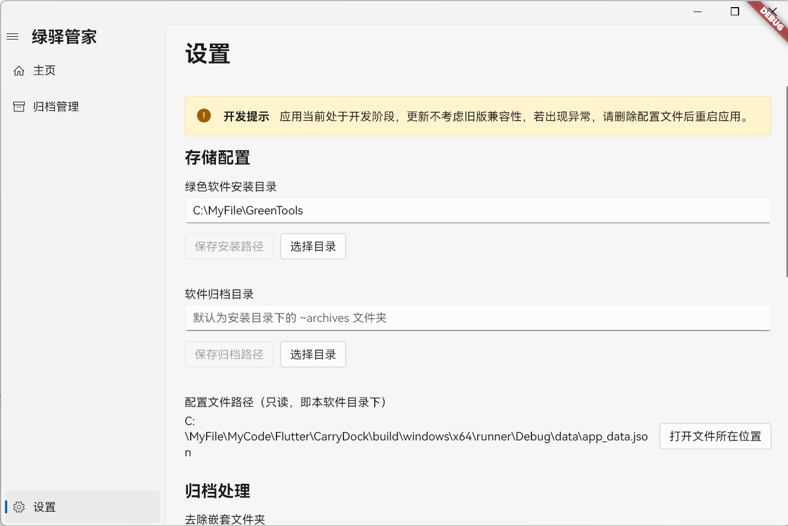

# CarryDock (绿驿管家)

CarryDock (
绿驿管家) 是一款专为 Windows 平台设计的绿色软件（便携软件）管理器。它旨在提供一个简洁、高效的方式来管理您的便携应用，无需安装，即刻使用。

## 核心功能

- 软件集中管理：自动扫描并展示安装目录内的绿色软件。
- 拖拽添加：拖入压缩包（ZIP/TAR 等）或可执行文件即可添加。
- 自动解压与归档：从压缩包添加时自动解压到安装目录，并可将源包（或可执行文件）归档保存。
- 主程序智能识别：
  - 单一可执行文件时自动设为主程序；
  - 多个可执行文件时弹窗供用户选择。
- 备选启动：从已安装目录中自动扫描可执行文件，支持选择备选程序启动。
- 视图模式：列表与网格两种展示模式一键切换。
- 排序控制：
  - 列表模式支持拖拽排序；
  - 也可在“调整软件顺序”对话框内批量调整并保存顺序。
- 未知项识别：识别安装目录下未托管的文件夹，以及归档目录下未关联的归档文件，便于清理或纳管。
- 归档管理（全新页面）：集中查看/管理归档与备份，支持手动关联、还原与删除。
- 备份与还原：
  - 为任意已托管软件创建带时间戳的备份 ZIP；
  - 从归档或备份进行还原（重新托管）。
- 批量扫描与统一关联：可对安装目录的子目录进行批量扫描，自动创建备份或统一关联到已有归档。
- 高度可配置：
  - 可自定义“安装目录”“归档目录”；
  - 可配置“可执行文件扩展名”与“搜索深度”；
  - 可选择“解压后是否移除多余嵌套目录”。
- 开发者选项：隐藏入口（设置页“版本”点击 5 次）可开启图标提取等测试功能。

## 技术栈

- **框架**: [Flutter](https://flutter.dev/)
- **UI 库**: [fluent_ui](https://pub.dev/packages/fluent_ui) - 实现了 Windows 11 设计风格的组件库。
- **窗口管理**: [bitsdojo_window](https://pub.dev/packages/bitsdojo_window) - 用于自定义窗口样式（标题栏、按钮等）。
- **状态管理**: [Provider](https://pub.dev/packages/provider) - 轻量级的状态管理方案。
- **文件处理**:
    - [archive](https://pub.dev/packages/archive) - 用于处理 `.zip` 和 `.tar` 等格式的压缩包。
    - [file_picker](https://pub.dev/packages/file_picker) - 用于打开系统文件选择器。
    - [desktop_drop](https://pub.dev/packages/desktop_drop) - 实现文件拖拽功能。
- **Windows API 交互**: [win32](https://pub.dev/packages/win32) - 直接调用 Windows 系统 API，用于提取
  `.exe` 图标和文件信息。

## 项目结构

项目遵循标准的 Flutter 项目结构，核心业务逻辑位于 `lib` 目录下：

- `main.dart`: 应用入口，负责初始化、路由和窗口设置。
- **`models/`**: 存放数据模型，如 `software.dart` 定义了软件对象的结构。
- **`providers/`**: 存放使用 Provider 进行状态管理的类，例如 `ThemeProvider` 用于主题切换。
- **`screens/`**: 包含应用的主要页面，如主页 (`home_screen.dart`) 和设置页 (`settings_screen.dart`)。
- `archive_manager_screen.dart`: 归档管理页面，集中查看/手动关联/删除归档与备份、从归档还原、创建备份。
- **`services/`**: 封装了应用的各项核心服务：
    - `software_service.dart`: 管理软件的添加、删除、加载等核心逻辑。
    - `settings_service.dart`: 负责应用设置的读取和存储。
    - `json_storage_service.dart`: 提供基于 JSON 文件的本地数据持久化。
    - `archive_extractor.dart`: 封装了各类压缩包的解压逻辑。
    - `executable_info_service.dart`: 调用 Windows API 来获取可执行文件的图标和描述信息。
    - 重要说明：`software_service` 内实现了批量扫描/归档、备份创建、统一关联、重新托管、排序持久化等核心能力。
- **`utils/`**: 存放通用工具类，如日志 (`logger.dart`)、全局错误处理 (`error_handler.dart`) 等。
- **`widgets/`**: 存放自定义的、可在多个页面复用的 UI 组件，例如软件列表项 (
  `software_list_tile.dart`)。

## 如何使用

1. **配置**: 首次启动应用后，请前往“设置”页面。
    - **必须**: 设置“绿色软件安装目录”，这是存放所有软件解压后文件的根目录。
    - **可选**: 设置“软件归档目录”，用于存放添加软件时上传的原始压缩包。若不设置，则默认为安装目录下的
      `~archives` 文件夹。
2. **添加软件**：
   - 点击主页“添加”，选择压缩包或可执行文件；
   - 或将文件直接拖拽到主界面；
   - 若解压后检测到多个可执行文件，会弹出“选择主程序”对话框。
3. **批量扫描与归档**：在主页的更多菜单中使用“扫描当前目录软件”。
   - 可选择是否为每个子目录创建备份 ZIP（默认创建）；
   - 扫描结束后若发现“可关联的归档”，会进入“统一关联”对话框，逐项选择要关联的归档或为未选择项创建备份；
   - 扫描/归档过程有可视化进度与结果摘要。
4. **归档管理**：在“归档管理”页面可执行：
   - 还原：从归档/备份进行安装（支持重复处理：备份现有、覆盖还原）；
   - 手动关联：将某个归档/备份手动关联至已托管软件；
   - 创建备份：为选定软件创建带时间戳的 ZIP 备份；
   - 打开归档/备份目录、删除文件（删除备份会同步清除其关联）。
5. **管理与启动**：
   - 主页单击软件即启动主程序；
   - 右键条目可打开安装或归档位置、创建备份、删除等；
   - 列表模式下可拖拽调整顺序，或通过“调整软件顺序”对话框批量调整；
   - 网格/列表模式可快速切换。
6. **重新托管**：当安装目录丢失且仍有归档时，列表项会显示“重新托管”入口，支持从归档恢复安装。

## 配置与设置说明

- 安装目录：绿色软件的根目录，扫描与解压的目标位置。
- 归档目录：
  - 默认使用安装目录下的 `~archives`；
  - 其中自动维护 `software_list.json`（托管列表）与 `software_list.lock`（写入锁）。
- 备份目录：归档目录下的 `backup` 子目录，备份文件命名为 `名称-YYYYMMDD_HHMMSS.zip`。
- 可执行文件识别：
  - 可配置“最大搜索深度”（默认 3 层）与“扩展名列表”（默认 `exe, bat`）；
  - 添加/还原时，将在安装目录内扫描可执行文件，单一结果自动选定，多个结果需手动选择。
- 归档处理：可选择“解压后移除多余嵌套目录”（默认开启）。
- 外观：可选择字体（默认 Microsoft YaHei UI）。
- 开发者选项：在“设置-关于-版本”连续点击 5 次启用，可进行图标提取等测试。

## 数据与存储

- 配置存储：应用配置保存在可执行文件同级的 `data/app_data.json`，并使用 `app_data.lock` 进行独占锁写入，避免并发覆盖。
- 托管软件列表：存放在“归档目录”根下的 `software_list.json`，并配套 `software_list.lock` 进行锁保护；该列表保存托管条目的 `id/name/installPath/executablePath/archivePath/backupPath/sortOrder` 等信息。
- 运行时状态：如“安装目录是否存在”“是否为备份归档”等不会持久化，仅用于 UI 呈现与交互判断。

## 重复与冲突处理

- 添加/还原时若检测到与现有软件或文件路径冲突：
  - 可选择重命名后添加（系统会提供安全的重命名建议）；
  - 或选择覆盖现有（可先备份，再覆盖还原）。

## 平台与限制

- 平台支持：仅支持 Windows 桌面（依赖 Win32 API 提取图标/文件信息，并使用 `explorer.exe` 打开目录/文件）。
- 安全性：
  - 归档解压实现内置路径穿越防护（安全拼接、目录边界校验）；
  - JSON/列表写入使用文件锁，避免多进程并发导致数据损坏。

## 开发与运行

- 需要 Flutter 桌面（Windows）开发环境。
- 典型命令：
  - 拉取依赖：`flutter pub get`
  - 运行调试：`flutter run -d windows`
  - 构建发布：`flutter build windows`

提示：若在 WSL 环境阅读源码，请在原生 Windows 终端进行构建与运行。
